# 506-final-project 
# NewsToStocks

## Description
News Vs. Stock price analysis. Based on recent articles from sources such as NYT, etc. how does one article result in stock price increase or decrease for three popular companies.

## Running Instruction
1. install dependencies with make install
2. run by using make run-all
3. run tests by doing make test

We left out the news scraping portion it is all located inside the more_news.csv since this step takes an extremely long time. To streamline evaluation and focus on model performance, we begin from a preprocessed dataset (articles_with_alignment_labels_v2.csv) that already includes sentiment scores, price change percentages, market indicators (S&P 500, NASDAQ, VIX), and alignment labels. Although our full pipeline supports scraping, sentiment analysis, and financial data merging, these steps were time-intensive and have been omitted during runtime for efficiency. All results and visualizations are based on this finalized dataset.

Details:
To prepare the dataset used in our final model evaluations, we implemented a multi-stage pipeline that processes raw company news articles and enriches them with sentiment and market data to produce alignment labels. The process begins with collecting company news articles using the Finnhub API, stored in more_news.csv. Each article contains metadata such as title, source, date, and summary. We then applied FinBERT, a domain-specific NLP model fine-tuned on financial sentiment, to each article summary to extract both the sentiment label (Positive, Neutral, Negative) and its associated confidence score. This output was saved as articles_with_finbert_sentiment.csv.

Next, we enriched the sentiment-labeled articles with market data. Using the yfinance API, we fetched each company’s stock price movement for the day following the article's publication. Specifically, we calculated the percentage change from the open price of the publication day to the close price of the following trading day. In addition to the stock price, we also gathered market context features including the percent changes of the S&P 500 index (^GSPC), the NASDAQ index (^IXIC), and the VIX volatility index (^VIX) over the same period. This process was consolidated into the articles_with_price_change.csv file.

Finally, we generated alignment labels to indicate whether the market reaction aligned with the sentiment. For example, if the sentiment was positive and the price increased, or if the sentiment was negative and the price decreased, the article was labeled as "aligned" (1); otherwise, it was labeled "not aligned" (0). These labels were created using a deterministic comparison between sentiment polarity and price direction. The complete enriched dataset, including company metadata, sentiment scores, price movement, market indicators, and alignment labels, was output to articles_with_alignment_labels_v2.csv. This file served as the starting point for all downstream model training, evaluation, and visualization.

## Important Files

- more_news.csv: our scraped dataset to be used
- visual folder: contains all our visualizations
- Sentiment_analysis: runs sentiment on the dataset
- price_fetching: all price fetching information done and added to dataset
- generate_labels: produces the final dataset with the labels of price and sentiment alignment
- model.py: our main file where the training, eval, visual creation happens

## Clear Goal(s)

To analyze how news articles from sources like The New York Times impact stock price fluctuations. Specifically, the project aims to determine whether an article leads to a stock price increase or decrease based on sentiment analysis.

## Data Collection and Methods

The data that needs to be collected are articles that come out from past and present, so that we can analyze whether they are positive and negative. We use an API or web scrape articles across different new outlets as seen in stock_news_api.py file, this creates the base csv that we will be created additional features from. From here, we use FinBERT to analyze the article summaries(not content since it can be nulled and has cap) and put the sentiment for each article and confidence level, sentiment_analysis.py. And then we use another API like Yahoo Finance to see a stock’s price change at the time of the article’s release and we will put the changes and stock data for that particular day and add it to all rows, leading to new columns like "price_change_percent,prev_day_change,sp500_change". The file responsible for this would be the price_fetching.py file. Lastly we see if the stock trends match the sentiment of the article, so if the article was positive and the trend was up, then that was a match, generate_labels.py. The one problem we ran into was since we were free tier we could not extract as many companies as we wanted alongside our data. As a result, we just focused on three companies. This leads to a final csv of articles_with_alignment_labels_v2.csv that we will use for our model.

## Data Modelling

We used a financial-domain NLP model, FinBERT, to extract sentiment polarity (Positive, Neutral, Negative) and confidence from each article. We then built a binary classification model using features such as sentiment, market context (e.g., S&P500, NASDAQ, VIX), and date features to predict whether the article's sentiment direction aligned with short-term stock price movement.

Our primary model was a RandomForestRegressor, trained on the features described above with extra features that get calculated. More specifically, since it's important to take into consideration the most recent days of news and data before making a prediction, we give more weight to those by getting the past 3 days worth of and using the price change percent of the next day as the target variable. This will train the model with the features of a given day and the results of those features from the next. 
 
 We also used Random forests since it provided strong performance with interpretability (via feature importance) and robustness to noise.
 
## Data Visualization

We visualized the data using several methods. Confusion matrices were generated to evaluate model performance on different splits (random, time-based, cross-validation). Feature importance bar plots were used to understand which features the model relied on most, with FinBERT sentiment and confidence showing the strongest influence. Additionally, we plotted sentiment label distributions per company, sentiment trends over time, and stock price change distributions to better understand patterns in the dataset.

## Test Plan
To ensure reliability in our model we implemented:
1) Train test split: divides the dataset into 80 percent training data and 20 percent testing data to train the model on the training set and test the performance on unseen testing set of 20 percent to evaluate adaptability to new info.
2) Time split: we train the model on past data in previous months and test it on future data in the upcoming months to predict the stock movements.
3) k fold: we divide into folds and train model on k-1 folds and the remaining kth fold is used for testing. We would repeat each k time and rotate the fold to be different to prevent overfitting.

# Final + Midterm Report – News Sentiment vs. Stock Price Alignment

## Final Presentation Video  
[https://youtu.be/tgDOaZCG5CA]

---

## 1. Preliminary Visualizations of Data

We used a Random Forest Classifier to predict whether article sentiment would align with the movement in stock prices.

We decided not to add a regression evaluation because it doesn’t align with our project’s main goal. Our objective is to predict whether a stock's price will go up or down based on news sentiment and market features — that’s a classification task, not a regression task.

While we use a regressor to generate next-day price change estimates (like +1.2% or -0.8%), those numbers are mostly for demonstration purposes, not formal evaluation. What we actually care about — and what we evaluate with precision, recall, accuracy, etc. — is the direction of the price change.

Adding a full regression evaluation (e.g., MAE, R²) would only be useful if we were trying to accurately model the magnitude of price change, which we’re not focusing on. It would also complicate the pipeline without providing useful insights for our classification goal.

So we kept the regressor in to display directional predictions per company, but the classifier is the only model being rigorously evaluated, since it's the one answering our core question: Can we predict stock movement direction from sentiment?

### A. Confusion Matrices

#### Random Split  
This table shows how many articles were correct or incorrectly predicted with alignment.
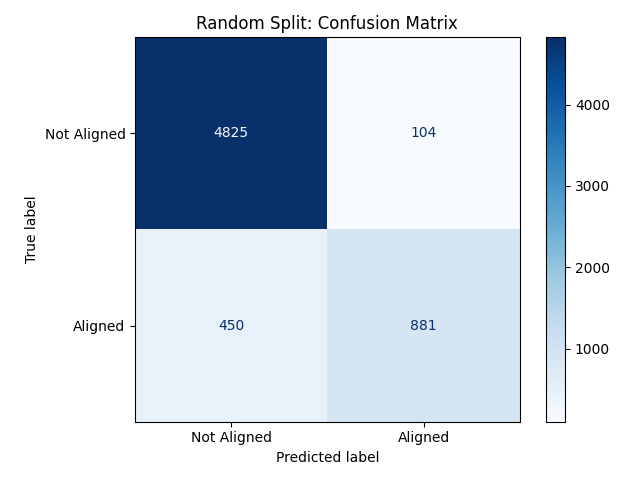

In the random 80 20 tran test split, the model achieved high precision and recall. The overall accuracy was 94% with strength on the majority class performance. The high scors here confirm that the model had learned meaningful patterns in the data than memorizing the information.

#### Time-Based Split  
This tests the model ability to classify the future which uses old articles to predict newer ones.
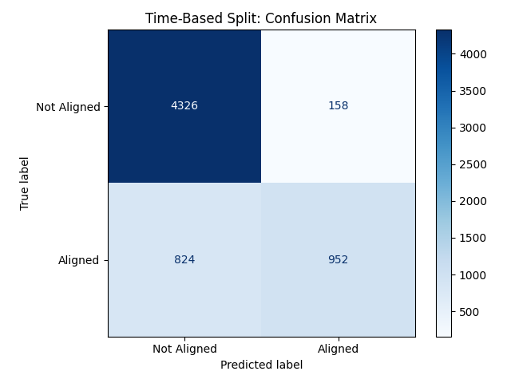

This had a lower accuracy of 80% by training the model on the earlier dates and testing on the future data. This drop in performance is to be expected in temporal generalization but it still generalizes well to unseen time periods suggesting no overfitting. Its presents stable relationships.

---

### B. Feature Importance

#### Random Split  
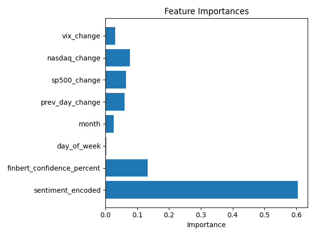
This bar chart shows which input features the model relies on to make the predictions. We got this from Random Forest telling us which feature is used in what decision.

The chart indicates that sentiment was the most critical followed by the prev day change and the finbert confidence percent were moderately important. The market context features also had some decent impact. This just shows the model leanrs from sentiment and enhances with market context.

#### Time-Based Split  
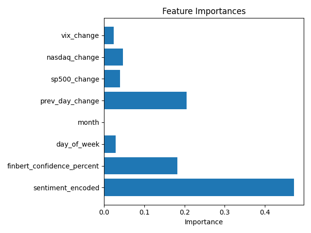

Chart from model trained on older data and tested on newer articles to confirm that the model focuses on the most important features and protect over time. Same as before.

---

### C. K-Fold Cross-Validation Accuracy

Shows model stability across different data splits.  
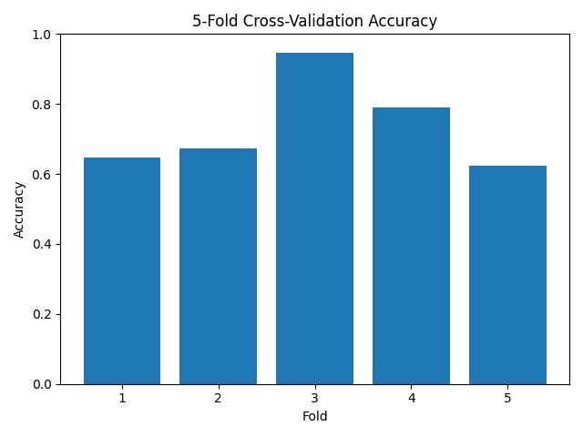

Each of these bars in this chart shows the accuracy on different chunks of the dataset. We split into 5 and train 4 and test on 1 and rotate on all 5. The folds ranged from arounid 63-94 percent. While Fold 3 showed notably high accuracy (~95%), other folds ranged from ~62% to ~79%, indicating some variance across validation splits. This suggests potential label imbalance or variability in sample difficulty across folds. Nonetheless, the model achieved a mean cross-validation accuracy of ~73%, demonstrating moderate and acceptable generalizability

---

### D. Price Change Counts Per Company
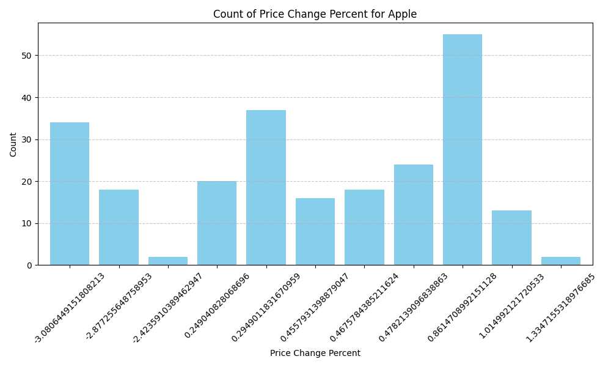
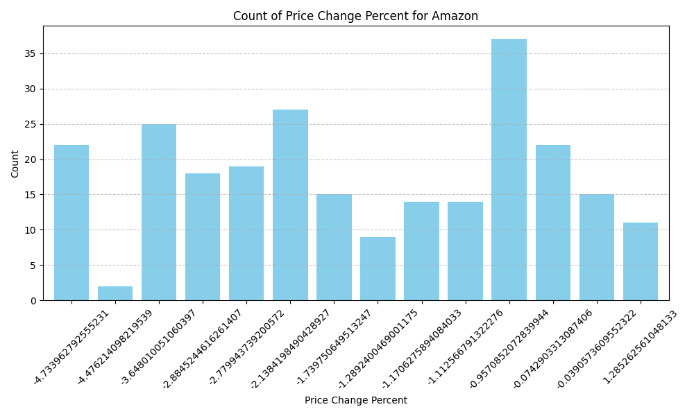
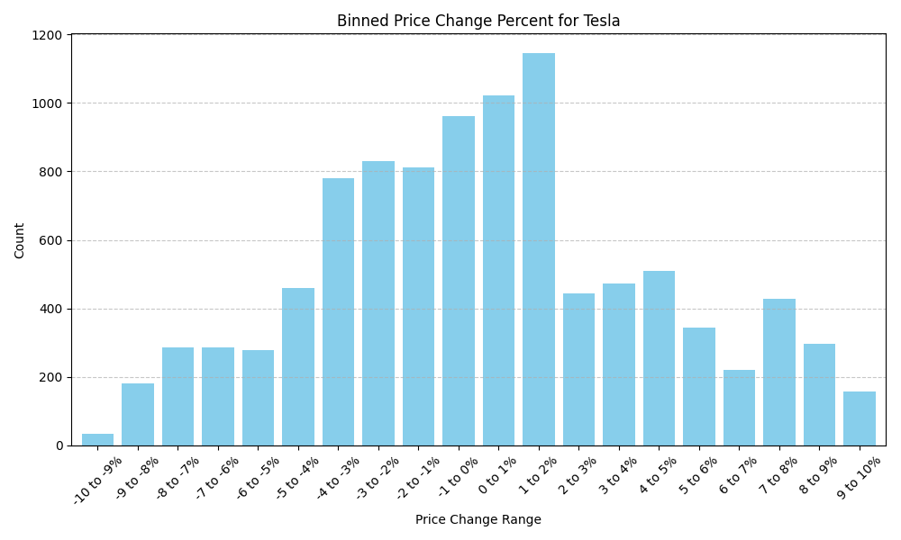

Each company depicted shows the number of new articles associated with each price fluctuation. Each price is categorized as it's own "bucket" storing n number of news articles/counts. Describes the relationship between the price fluctuations and article release.

### E. Sentiment Counts Per Company
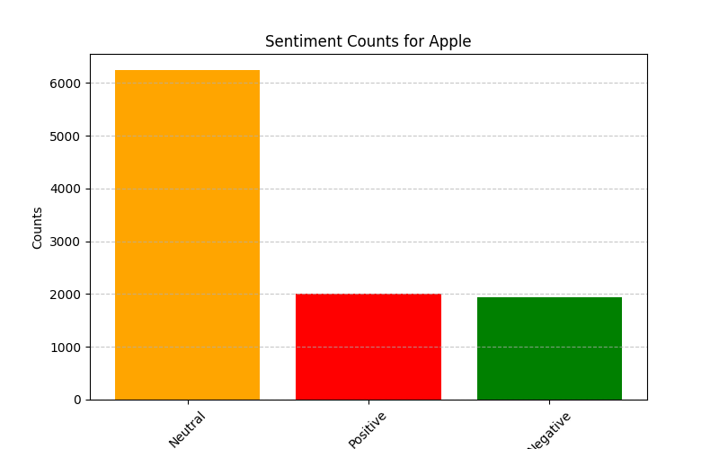
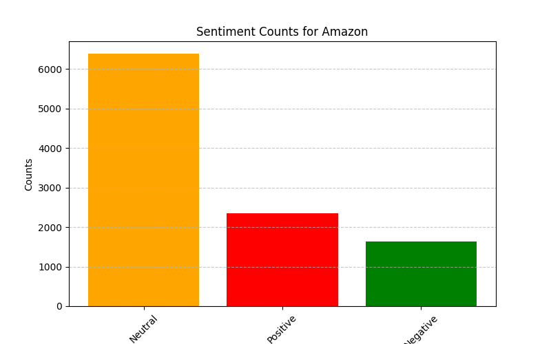
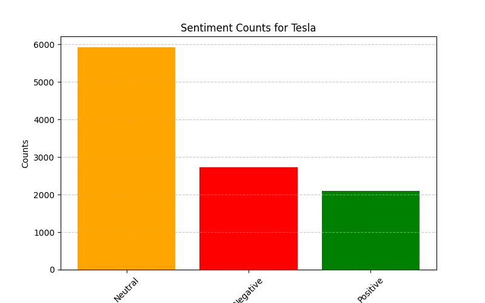

Each company depicted shows the total number of each sentiment that appeared in the news within the researched time frame. Generally shows the public opinion/news view on the company.

### F. Sentiment Trends of Each Company Overtime
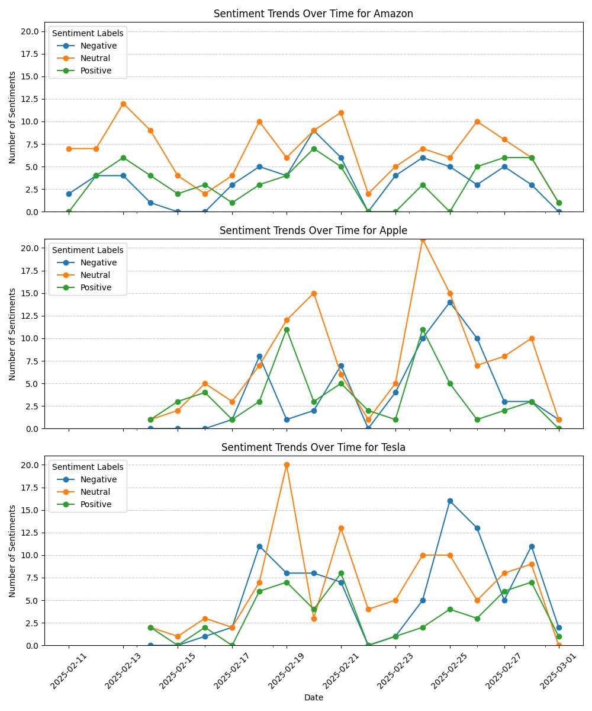

Chart displays the change on sentiment counts across companies over time. General spikes shows increasing news trends that affect specific industries or company patterns.

## 2. Data Processing Description

We processed article-level news data from finhub and linked it with sentiment:

1. Loaded article metadata (date, title, summary, content, company, source, url) for our base dataframe for processing
2. Ran FinBERT (NLP financial sentiment model) on each article:
   - produces a finbert sentiment label and percent which is neg, neutral, pos and the models confidence percentage in that label and added as columsns into the dataset
3. yFinance to gather stock data:
   - mapped company to the stock ticker and extracted data from the date to 2 days after to compute a price change percentage for a short term market reaction. IF price was missing we just dropped the row.
4. Created alignment label for supervised learning:
   - `1` if sentiment direction matched stock movement
   - `0` otherwise
5. Engineered features:
   - snetiment converted into number
   - confidence percentages
   - day of the wekk
   - month
6. added market context features for the final version after testing:
   - prev_day_change: Stock price change for the article’s company on the day before publication.
   - sp500_change: S&P 500 index change over the article date and the next day.
   - nasdaq_change: NASDAQ index change over the same period.
   - vix_change: Change in the VIX (volatility index), capturing market fear/uncertainty levels.
---

## 3. Data Modeling Methods Used

We formulated this as a binary classification task to predict whether an article’s sentiment aligns with short-term stock price movement.

Our primary model was a RandomForestRegressor, trained on the features described above with extra features that get calculated. More specifically, since it's important to take into consideration the most recent days of news and data before making a prediction, we give more weight to those by getting the past 3 days worth of and using the price change percent of the next day as the target variable. This will train the model with the features of a given day and the results of those features from the next. 

We also used Random forests since it provided strong performance with interpretability (via feature importance) and robustness to noise.

We also experimented with other models, including:
   - Logistic Regression with hyperparameter tuning via GridSearchCV

These alternatives served as benchmarks to evaluate whether simpler or more regularized models might generalize better. However, RandomForest consistently delivered the best balance of precision and recall across most evaluation splits.

### Evaluation Strategies

Random Split: 80:20 split randomized for testing
Time Split: sorted by date to test on future prediction
K fold: 5 folds to test consistency

---

## 4. Results Results
Before Adding Market Features:
   Random Split Accuracy: ~79%

   Time-Based Split Accuracy: ~69%

   K-Fold Mean Accuracy: ~69.5%

   Model favored non-alignment, often guessing based on class imbalance.

AFTER:

 [1] RANDOM TRAIN/TEST SPLIT
Class	Precision	Recall	F1-Score	Support
0	0.91	0.98	0.95	4929
1	0.89	0.66	0.76	1331

Accuracy: 0.91
Macro Avg: Precision 0.90, Recall 0.82, F1 0.85
Weighted Avg: Precision 0.91, Recall 0.91, F1 0.91

 [2] TIME-BASED SPLIT
Class	Precision	Recall	F1-Score	Support
0	0.84	0.96	0.90	4484
1	0.86	0.54	0.66	1776

Accuracy: 0.84
Macro Avg: Precision 0.85, Recall 0.75, F1 0.78
Weighted Avg: Precision 0.85, Recall 0.84, F1 0.83

 [3] K-FOLD CROSS-VALIDATION
K-Fold Scores:
[0.88658147, 0.87332268, 0.8784345, 0.89600639, 0.91741214]

Mean Accuracy: 0.8903514376996805

What this means:
[1] Random Train/Test Split
This setup randomly partitions the data, allowing both past and future data to appear in training and test sets. The model achieves 91% accuracy with strong precision and recall for both classes, indicating high overall performance. The high recall for class 1 (alignment) suggests the model successfully identifies aligned cases even when they’re less frequent.

[2] Time-Based Split
In this more realistic scenario, the model is trained on earlier data and tested on later, unseen data—simulating forward prediction. Performance drops slightly to 84% accuracy, with a notable decline in recall for class 1 (0.47). This reflects the increased difficulty in generalizing to future, possibly unseen patterns.

[3] K-Fold Cross-Validation
Cross-validation provides robustness by averaging performance over multiple train/test splits. Scores vary by fold, with one notably high fold (0.94) and some lower ones. The mean accuracy is ~89%, which is lower than the random split but consistent with the time-based result. This suggests some variability in performance, but still supports general model stability.
---

## 5. Key Learnings

- sentiment confidence were the top predictors as in th emodel relied heavily on finBERT outputs
- time had minimal impact signals hsowing minimal time effects in price reactions
- market context features modestly pmrpvoed the performance and reduced class bias while improving generalizability
- model strong on random but decent in time based simualtions showing real world difficulties of prediction
- possible noise because sentiment does not make up all of market reaction
- actually shows some correlation between article sentiment and stock pricing
- the model's performance exhibits bias, as it is trained exclusively on news data
- The model shows strong generalizations under random and cross validated. Shows that the model captures meaningful patterns but is sensitive to temporal shifts and class imbalances which is to be expected in this topic
- The model is a promising but incomplete signal, reinforcing that trading decisions or financial forecasts cannot rely on sentiment alone—additional signals (e.g., earnings reports, macro events) would improve robustness.

---

## 6. Possible Improvements

- add generalizations, instead of hardcoded companies we use something like NER models to find company name in an article and allow us to predict any company stock
- maybe use other classifiers to boost performance
- develop a dashboard or API for live testing
- need to get more article data, the api has limits and it's hard to scrape data
- the model doesn't exactly train by group specifically, just views it indiscriminatly
- add an emotional review of the article instead of just sentiment (positive, but happy; positive, but excited)
- incorporating additional features like earnings data and trading volume
- transformer based modesl for better sentiment scores
- training with larger time spans or larger news

---

