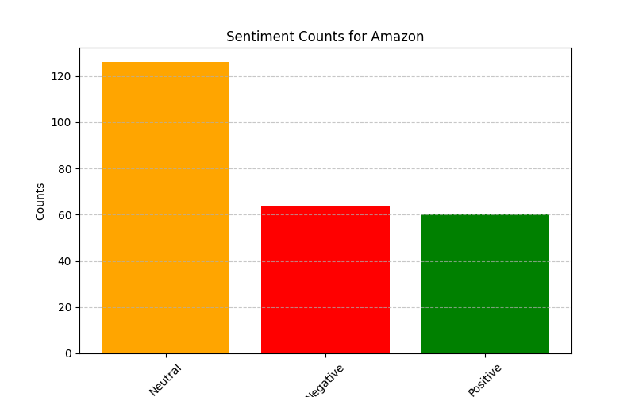

# 506-final-project 
# NewsToStocks

## Description
News Vs. Stock price analysis. Based on recent articles from sources such as NYT, etc. how does one article result in stock price increase or decrease.

## Clear Goal(s)

To analyze how news articles from sources like The New York Times impact stock price fluctuations. Specifically, the project aims to determine whether an article leads to a stock price increase or decrease based on sentiment analysis.

## Data Collection and Methods

The data that needs to be collected are articles that come out from past and present, so that we can analyze whether they are positive and negative. We can use an API or web scrape articles across different new outlets and use another API like Yahoo Finance to see a stock’s price change at the time of the article’s release. 

## Data Modelling

First, we’d need to use a NLP model to more accurately understand the meaning behind an article. Then, we plan on modeling the data through a linear regression model that associates the degree of positivity/negativity with past occurrences of increase/decrease in stock price

## Data Visualization

We plan on using scatter plots, box plots, and other various data visualization methods to plot the sentiment scores versus the stock price variations to view changes. Additionally, we would have a time series plot to view the stock price fluctuations while marking article release. Finally, we would have heatmaps to view the correlation matrix between sentiment and stock price changes.

## Test Plan
To ensure reliability in our model we will implement:
1) Train test split: divides the dataset into 80 percent training data and 20 percent testing data to train the model on the training set and test the performance on unseen testing set of 20 percent to evaluate adaptability to new info.
2) Time split: we train the model on past data in previous months and test it on future data in the upcoming months to predict the stock movements.
3) k fold: we divide into folds and train model on k-1 folds and the remaining kth fold is used for testing. We would repeat each k time and rotate the fold to be different to prevent overfitting.

# Midterm Report – News Sentiment vs. Stock Price Alignment

## Midterm Presentation Video  
[Insert YouTube link here]

---

## 1. Preliminary Visualizations of Data

We used a Random Forest Classifier to predict whether article sentiment would align with the movement in stock prices.

### A. Confusion Matrices

#### Random Split  
This table shows how amny articles were correct or incorrectly predicted with alignment.

We got this from randomly splitting the dataset and training and comparing predictions to the actual labels. This matrix shows that the model is pretty good at identifying the non aligned articles and some aligned ones with a little bit more difficulty. This has our best accuracy of 79%.

#### Time-Based Split  
This tests the model ability to classify the future which uses old articles to predict newer ones.

We did this by sorting by date and testing on the first 80% and then the most recent remainder. By doing so, we test a more realistic scenario and tested our model on future data that we cannot see. This had an accuracy of 69%.

---

### B. Feature Importance

#### Random Split  

This bar chart shows which input features the model relies on to make the predictions. We got this from Random Forest telling us which feature is used in what decision.

The chart indicates that the FinBERT confidence was the strongest feature which was how confident the model was in the labelling followed closely by the positive neutral negative labelling. Dates were pretty useless.

#### Time-Based Split  

Chart from model trained on older data and tested on newer articles to confirm that the model focuses on the most important features and protect over time.

---

### C. K-Fold Cross-Validation Accuracy

Shows model stability across different data splits.  

Each of these bars in this chart shows the accuracy on different chunks of the dataset. We split into 5 and train 4 and test on 1 and rotate on all 5. Generally, it shows stability with accuracy from 58-76 percent.

---

### D. Price Change Counts Per Company

Each company depicted shows the number of new articles associated with each price fluctuation. Each price is categorized as it's own "bucket" storing n number of news articles/counts. Describes the relationship between the price fluctuations and article release.

### E. Sentiment Counts Per Company

Each company depicted shows the total number of each sentiment that appeared in the news within the researched time frame. Generally shows the public opinion/news view on the company.

### F. Sentiment Trends of Each Company Overtime

Chart displays the change on sentiment counts across companies over time. General spikes shows increasing news trends that affect specific industries or company patterns.

## 2. Data Processing Description

We processed article-level news data from finhub and linked it with sentiment:

1. Loaded article metadata (date, title, summary, content, company, source, url) for our base dataframe for processing
2. Ran FinBERT (NLP financial sentiment model) on each article:
   - produces a finbert sentiment label and percent which is neg, neutral, pos and the models confidence percentage in that label and added as columsns into the dataset
3. yFinance to gather stock data:
   - mapped company to the stock ticker and extracted data from the date to 2 days after to compute a price change percentage for a short term market reaction. IF price was missing we just dropped the row.
4. Created alignment label for supervised learning:
   - `1` if sentiment direction matched stock movement
   - `0` otherwise
5. Engineered features:
   - snetiment converted into number
   - confidence percentages
   - day of the wekk
   - month

---

## 3. Data Modeling Methods Used

We tried to solve this as a binary classification problem to determine whether we can predict that an article sentiment aligns with short term stock price changes.

We used RandomFOrestClassifier with a target variable of the alignment label and features mentioned above to train it.

### Evaluation Strategies

Random Split: 80:20 split randomized for testing
Time Split: sorted by date to test on future prediction
K fold: 5 folds to test consistency

---

## 4. Preliminary Results

Random: 79%
Time: 69%
kfold: 69.5%

Random was the best case performance with the other strategies simulating other real world scenarios. Model seemed to be more confident with non alignment.

---

## 5. Key Learnings

- sentiment confidence were the top predictors as in th emodel relied heavily on finBERT outputs
- time had minimal impact signals
- model strong on random but decent in time based simualtions
- possible noise because sentiment does not make up all of market reaction
- actually shows some correlation between article sentiment and stock pricing
- the model's performance exhibits bias, as it is trained exclusively on news data

---

## 6. What’s Next

- add generalizations, instead of 5 companies we use something like NER models to find company name in an article and allow us to predict any company stock
- maybe use other classifiers to boost performance
- add a control variable to compare the specific stock price to (S&P 500)
- add stock price at the start of the day
- add stock price at the end of the day
- develop a dashboard or API for live testing
- include additional features like volaitility or trade volume or indicators to expand
- need to get more article data, the api has limits and it's hard to scrape data
- the model doesn't exactly train by group specifically, just views it indiscriminatly
- add an emotional review of the article instead of just sentiment (positive, but happy; positive, but excited)

---

